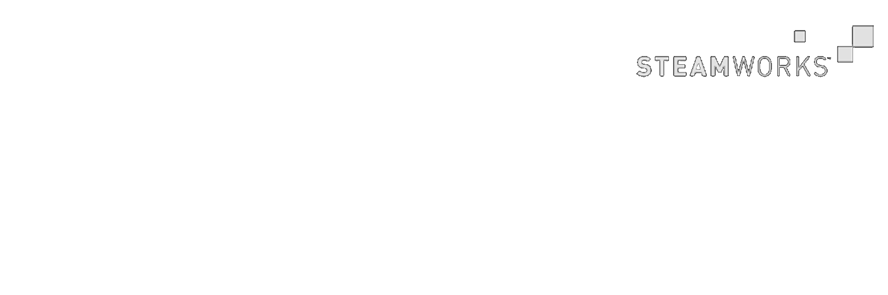
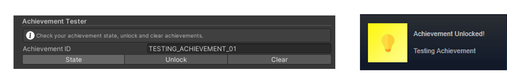

<!-- PROJECT LOGO -->
 

    
  </a>

<!-- ABOUT THE PROJECT -->

## About The Project

These are tools made to help you test your Steamworks Integration for your game.

<!-- GETTING STARTED -->

## Getting Started

Make sure you have all Prerequisities installed before using these Tools.

After installing all prequisities copy all scripts into a folder in your project and add them to an empty game object in your project.

Make sure you are in the play mode when using these tools.

<!-- PREREQUISITES -->

## Prerequisites

- [Steamworks SDK](https://partner.steamgames.com/downloads/list)
- [Facepunch Steamworks Wrapper](https://wiki.facepunch.com/steamworks/)
- [Odin Inspector Plugin](https://odininspector.com)

<!-- IMAGES -->

## Images

    
  </a>

<!-- LICENSE -->

## License

Distributed under the MIT License. See `LICENSE.txt` for more information.

<!-- CONTACT -->

## Contact

Jari Juvonen - [@maybeJari](https://twitter.com/maybejari) - jari@honkertown.studio

Project Link: [https://github.com/maybeJari/Unity-Steamworks-Testing-Tools](https://github.com/maybeJari/Unity-Steamworks-Testing-Tools)
 
 

<!-- ICONS -->

[![Contributors][contributors-shield]][contributors-url]
[![Forks][forks-shield]][forks-url]
[![Stargazers][stars-shield]][stars-url]
[![Issues][issues-shield]][issues-url]
[![MIT License][license-shield]][license-url]

 

    Made with ❤️ by: Jari
     

  

  

<!-- MARKDOWN LINKS & IMAGES -->
<!-- https://www.markdownguide.org/basic-syntax/#reference-style-links -->

[contributors-shield]: https://img.shields.io/github/contributors/maybeJari/Unity-Steamworks-Testing-Tools.svg?style=for-the-badge
[contributors-url]: https://github.com/maybeJari/Unity-Steamworks-Testing-Tools/graphs/contributors
[forks-shield]: https://img.shields.io/github/forks/maybeJari/Unity-Steamworks-Testing-Tools.svg?style=for-the-badge
[forks-url]: https://github.com/maybeJari/Unity-Steamworks-Testing-Tools/network/members
[stars-shield]: https://img.shields.io/github/stars/maybeJari/Unity-Steamworks-Testing-Tools.svg?style=for-the-badge
[stars-url]: https://github.com/maybeJari/Unity-Steamworks-Testing-Tools/stargazers
[issues-shield]: https://img.shields.io/github/issues/maybeJari/Unity-Steamworks-Testing-Tools.svg?style=for-the-badge
[issues-url]: https://github.com/maybeJari/Unity-Steamworks-Testing-Tools/issues
[license-shield]: https://img.shields.io/github/license/maybeJari/Unity-Steamworks-Testing-Tools.svg?style=for-the-badge
[license-url]: https://github.com/maybeJari/Unity-Steamworks-Testing-Tools/blob/master/LICENSE.txt
